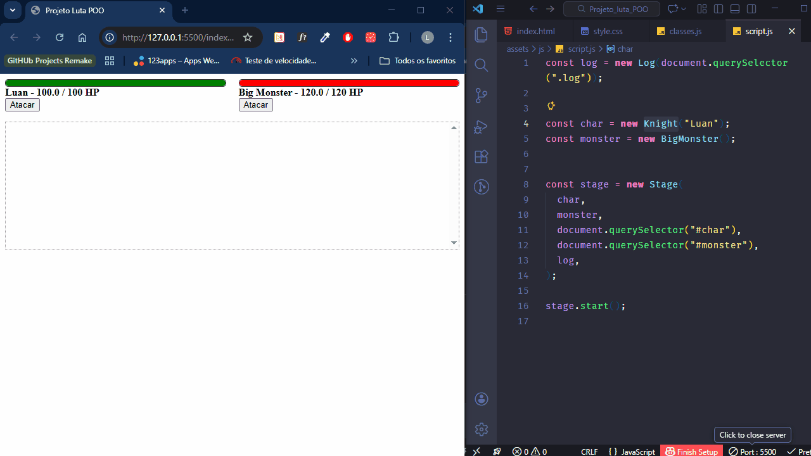

# 🗡️ Estudo de POO em JavaScript – Sistema de Batalha

Projeto prático desenvolvido para aplicar conceitos fundamentais da **Programação Orientada a Objetos (POO)** utilizando **JavaScript**, por meio da simulação de uma batalha entre personagens.

---

## 📌 Sobre o Projeto

Neste exercício, foi desenvolvido um pequeno "jogo" onde dois personagens realizam ataques entre si, com atualização dinâmica da barra de vida e registro das ações em tela.

O objetivo principal foi **fixar conceitos de POO**, transformando teoria em prática de forma clara e organizada.

---

## 🧠 Conceitos de POO aplicados

- Classes e objetos
- Instância de objetos
- Herança
- Encapsulamento
- Métodos `get` e `set`
- Reutilização de código
- Modelagem de classes base

---

## ⚙️ Funcionalidades

- Sistema de ataque entre personagens
- Cálculo dinâmico de dano e defesa
- Atualização visual da barra de vida
- Registro de ações (log de batalha)
- Validação de atributos via getters e setters

---

## 🛠️ Tecnologias utilizadas

- JavaScript (ES6+)
- HTML5
- CSS3

---

## 🎯 Objetivo do exercício

Praticar e consolidar os principais conceitos da Programação Orientada a Objetos em JavaScript, com foco em organização, reutilização de código e clareza lógica.

---

## 🚀 Aprendizados

Este exercício representou um desafio importante no meu aprendizado, exigindo atenção aos detalhes e raciocínio lógico para estruturar corretamente as classes, métodos e interações entre os objetos.

Com o apoio do professor **Bonieky Lacerda (B7Web)**, consegui desenvolver a solução aplicando boas práticas e reforçando conceitos essenciais da POO.

---

## 📸 Demonstração

  

---

## 📄 Licença

Este projeto está sob a licença MIT.
